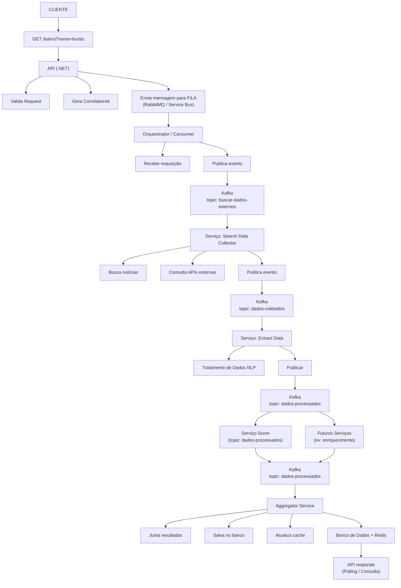

# BairrosEmAlta API

API REST em .NET 10 Minimal API para o projeto de mapa de calor imobiliário de Belo Horizonte.

## Stack

- **.NET 10** — Minimal API
- **MediatR** — Use cases (CQRS)
- **Clean Architecture** — Domain / Application / Infrastructure / API
- **Swagger/OpenAPI** — Documentação interativa
- **Docker** — Dockerfile multi-stage + docker-compose

## Estrutura

```
src/
├── BairrosEmAlta.Domain/           # Entidades e enums — sem dependências externas
│   ├── Entities/
│   │   ├── Neighborhood.cs
│   │   ├── NeighborhoodMetrics.cs
│   │   └── NeighborhoodTransaction.cs
│   └── Enums/
│       └── NeighborhoodStatus.cs   # HighValorization | Growing | Stable
│
├── BairrosEmAlta.Application/      # Use cases, DTOs, interfaces de repositório
│   ├── DTOs/
│   ├── Interfaces/
│   │   └── INeighborhoodRepository.cs
│   └── UseCases/
│       ├── GetAllNeighborhoods/
│       └── GetNeighborhoodById/
│
├── BairrosEmAlta.Infrastructure/   # Implementações concretas
│   ├── DI/
│   └── Repositories/
│       └── NeighborhoodMockRepository.cs
│
└── BairrosEmAlta.API/              # Entry point — endpoints, CORS, Swagger
    ├── Endpoints/
    │   └── NeighborhoodEndpoints.cs
    └── Program.cs
```

## Endpoints

| Método | Rota | Descrição |
|--------|------|-----------|
| `GET` | `/api/neighborhoods` | Lista todos os bairros com score e métricas |
| `GET` | `/api/neighborhoods/{id}` | Retorna um bairro pelo ID (404 se não encontrar) |

## Como rodar

### Local

```bash
dotnet run --project src/BairrosEmAlta.API
# http://localhost:5140
# Swagger: http://localhost:5140/swagger
```

### Docker

```bash
docker compose up --build
# http://localhost:8080
# Swagger: http://localhost:8080/swagger
```

## Postman

Importe o arquivo `BairrosEmAlta.postman_collection.json` no Postman.
A variável `{{baseUrl}}` aponta para `http://localhost:5140` por padrão — altere para `http://localhost:8080` ao usar Docker.

---

## Arquitetura do Sistema

Visão completa do fluxo planejado — da requisição do cliente até a resposta com dados processados via event-driven architecture.


